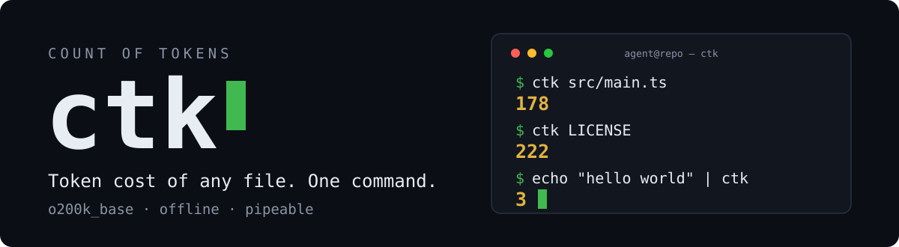

<p align="center">
  <picture>
    <source media="(prefers-color-scheme: dark)" srcset="./assets/readme/hero-dark.svg">
    <source media="(prefers-color-scheme: light)" srcset="./assets/readme/hero-light.svg">
    
  </picture>
</p>

`ctk` prints how many tokens a file weighs in an LLM context window. Like `wc`, but it counts model tokens, not words. The output is a bare number on stdout, so it pipes into anything — shell guards, git hooks, agent scripts.

<p align="center">
  <a href="https://github.com/psychosomat/ctk/releases"></a>
  <a href="./LICENSE"></a>
  <a href="https://bun.sh"></a>
  <a href="https://github.com/openai/tiktoken"></a>
  <a href="./src/main.ts"></a>
</p>

## Install

One command with [Bun](https://bun.sh) 1.0 or newer:

```sh
bun install -g github:psychosomat/ctk
```

## Usage

```sh
ctk file.txt        # count a file
cat file.txt | ctk  # or count stdin
```

<details>
<summary><b>Uninstall / develop on the source</b></summary>

```sh
bun remove -g ctk   # remove a global install

git clone https://github.com/psychosomat/ctk && cd ctk
bun install && bun link   # run your local clone as `ctk`
```

</details>

## Pipe it anywhere

`stdout` carries one integer per input file. That is the entire interface:

```sh
ctk prompt.md                # cost of one file
git diff | ctk               # cost of a patch
find . -name '*.md' -exec ctk {} + | awk '{s+=$1} END {print s}'   # a whole folder
```

That makes it a gauge for anything that spends a context window:

```sh
# exit 0 only if the file fits a 4k-token budget
ctk notes.md | awk '{exit ($1 <= 4096) ? 0 : 1}'

# fail a hook when a prompt file outgrows its budget
[ "$(ctk system-prompt.md)" -le 8000 ]
```

<details>
<summary><b>Behavior contract</b></summary>

- Input must be UTF-8. Invalid byte sequences decode to U+FFFD before counting.
- With no argument and a terminal attached, `ctk` prints `usage: ctk <file>` to stderr and exits `1`.
- A missing file prints the error to stderr and exits `1`.
- Multiple files via `find -exec ctk {} +` print one number per line, in argument order.

</details>

## Why it holds up

<table border="0">
  <tr>
    <td width="50%" valign="top">
      <h3>Exact, not estimated</h3>
      <p>Real BPE encoding with the <code>o200k_base</code> ranks — the same tokenizer OpenAI ships in <code>tiktoken</code>. Counts match the official Python implementation token for token.</p>
    </td>
    <td width="50%" valign="top">
      <h3>Unix-grade</h3>
      <p>A number on stdout, errors on stderr, exit codes you can script against. No banners, no progress bars, no config.</p>
    </td>
  </tr>
  <tr>
    <td width="50%" valign="top">
      <h3>Fully offline</h3>
      <p>The BPE ranks ship inside the <code>js-tiktoken</code> dependency. Zero network calls at runtime, startup to result in about half a second.</p>
    </td>
    <td width="50%" valign="top">
      <h3>Auditable in one screen</h3>
      <p>The entire program is a 22-line Bun script. There is nothing else to trust — read it and you know what it does.</p>
    </td>
  </tr>
</table>

<details>
<summary><b>That's the entire program</b></summary>

```ts
#!/usr/bin/env bun
import { readFileSync } from "node:fs";
import { Tiktoken } from "js-tiktoken/lite";
import o200k_base from "js-tiktoken/ranks/o200k_base";

function readInput(): string | null {
	const path = process.argv[2];
	if (path) return readFileSync(path, "utf8");
	return process.stdin.isTTY ? null : readFileSync(0, "utf8");
}

try {
	const text = readInput();
	if (text === null) {
		console.error("usage: ctk <file>");
		process.exit(1);
	}
	console.log(new Tiktoken(o200k_base).encode(text).length);
} catch (error) {
	console.error(`ctk: ${error instanceof Error ? error.message : error}`);
	process.exit(1);
}
```

</details>

## What it counts

`ctk` uses the `o200k_base` byte-pair encoding from OpenAI's tiktoken.

| Encoding | Applies to | Counts match? |
| :--- | :--- | :--- |
| `o200k_base` (this tool) | GPT-4o, GPT-4.1, o-series | yes — what `ctk` reports |
| `cl100k_base` | GPT-4, GPT-3.5-turbo | close, but not identical |
| other tokenizers | Claude, Gemini | differ |

<details>
<summary><b>Verify parity with the official Python tiktoken</b></summary>

Encode the same file with both tools and compare the numbers:

```sh
python3 -m venv .venv
.venv/bin/pip install tiktoken
.venv/bin/python -c "import tiktoken; print(len(tiktoken.get_encoding('o200k_base').encode(open('file.txt', 'rb').read().decode('utf-8'))))"
ctk file.txt
```

Encoding is also lossless: every input survives encode and decode unchanged.

</details>

## Development

```sh
bun run lint        # biome check
bun run typecheck   # tsc --noEmit
```

## License

[MIT](./LICENSE)
