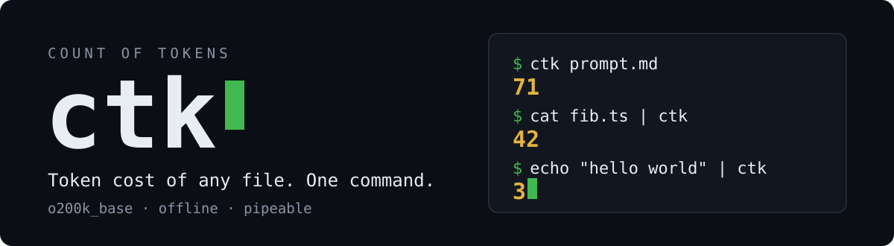

<p align="center">
  
</p>

`ctk` (Count of Tokens) prints how many tokens a file costs in an LLM context window. It works like `wc`, but counts model tokens instead of words. Output is a bare number on stdout, so it pipes into anything.

## Install

One command with [Bun](https://bun.sh) 1.0 or newer:

```sh
bun install -g github:psychosomat/ctk
```

To develop on the source instead, link a clone:

```sh
git clone https://github.com/psychosomat/ctk && cd ctk
bun install && bun link
```

Remove either install with `bun remove -g ctk`.

## Usage

```sh
ctk file.txt        # count a file
cat file.txt | ctk  # count stdin
```

- Text must be UTF-8. Invalid byte sequences decode to U+FFFD before counting.
- With no argument and a terminal attached, `ctk` prints usage to stderr and exits with code 1.
- A missing file prints the error to stderr and exits with code 1.

## What it counts

`ctk` uses the `o200k_base` byte-pair encoding from OpenAI's tiktoken. That encoding matches GPT-4o, GPT-4.1, and the o-series models. Other model families (GPT-4 on `cl100k_base`, Claude, Gemini) use different tokenizers, so their counts differ.

## How it works

`ctk` is a 22-line Bun script over [`js-tiktoken`](https://github.com/dqbd/tiktoken). The BPE ranks ship inside the dependency, so the tool runs offline and makes no network calls. Startup and counting take about 0.5 s per invocation, dominated by parsing the ranks file.

Counts match the official Python `tiktoken` implementation. To reproduce the check, encode the same file with both tools and compare the numbers:

```sh
python3 -m venv .venv
.venv/bin/pip install tiktoken
.venv/bin/python -c "import tiktoken; print(len(tiktoken.get_encoding('o200k_base').encode(open('file.txt', 'rb').read().decode('utf-8'))))"
ctk file.txt
```

Encoding is also lossless: every input survives encode and decode unchanged.

## Development

```sh
bun run lint        # biome check
bun run typecheck   # tsc --noEmit
```
